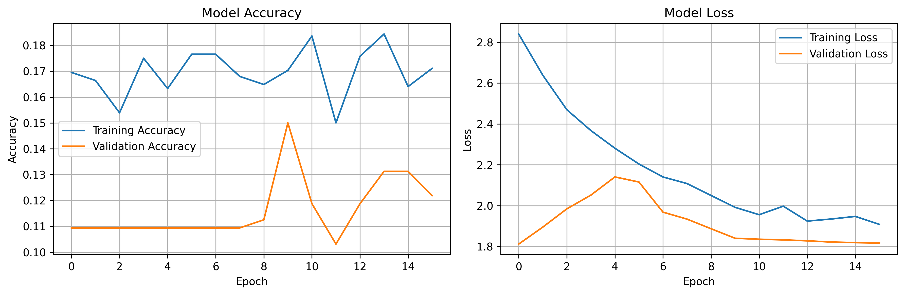
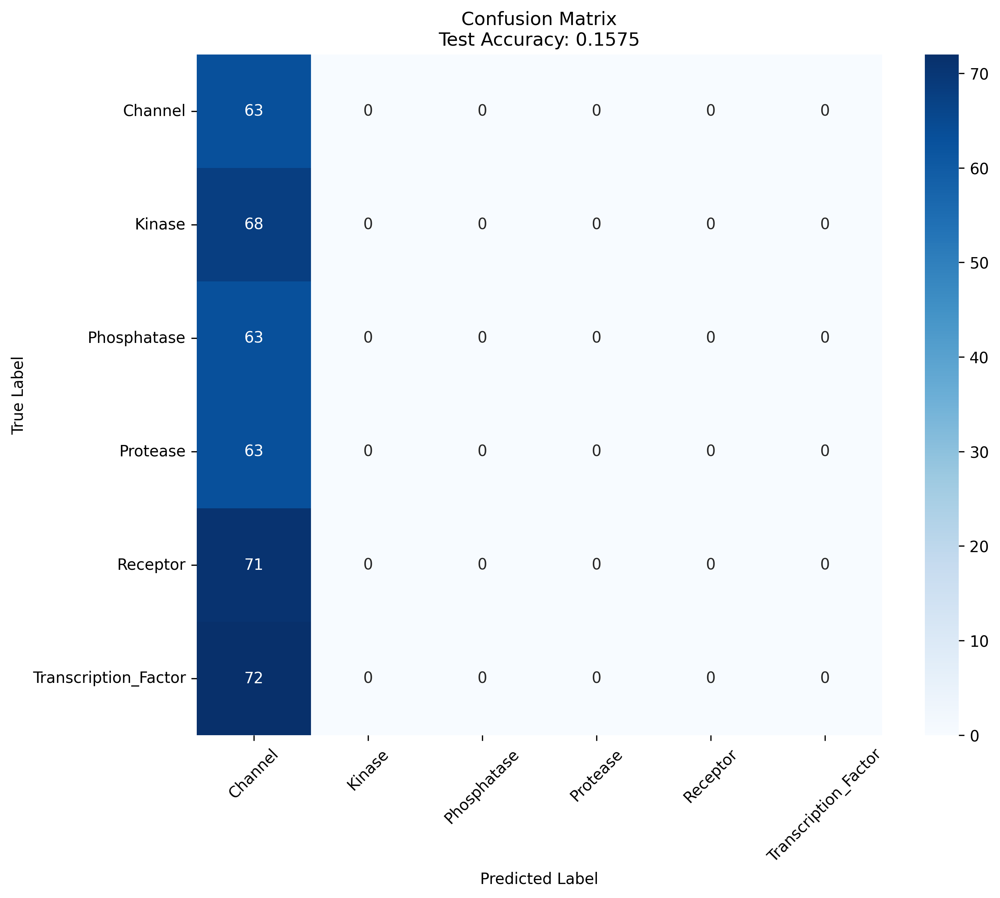

# Deep Learning for miRNA Classification

## Research context

This repository implements a CNN-based classifier for miRNA sequences, built to
extend the computational miRNA-target discovery pipeline described in my manuscript
*"Literature-Based Validation of miRNA Targeting in Lung Cancer: A Computational
Approach."* That study used miRanda, TargetScan, and RNAhybrid to predict miRNAs
targeting four frequently mutated lung cancer genes (EGFR, ERBB2, KRAS, TP53), then
validated candidates against experimental literature — identifying **miR-93** and
**miR-939** as strongly validated regulators of EGFR, TP53, and ERBB2.

This repo is the next step: a deep learning approach to classify miRNA sequences by
their functional target family directly from sequence, rather than relying solely on
seed-matching algorithms.

## Status: pipeline validated, awaiting real training data

The full pipeline — one-hot sequence encoding, CNN architecture (3 conv layers,
batch norm, dropout), training loop with early stopping, and evaluation (accuracy,
confusion matrix, classification report) — has been run end-to-end and confirmed
working. Database access (miRBase, miRTarBase) needed to assemble a real labeled
training set was unavailable at the time of this validation run, so the run below
uses **randomly generated synthetic sequences and labels**, purely to confirm the
pipeline executes correctly and produces sane, interpretable output.

**Result: 15.75% test accuracy on 6 classes** (chance level ≈ 16.7%). This is the
*expected* outcome for label-free random data, and it's a useful sanity check in
itself — it confirms there's no data leakage or bug artificially inflating the score.
The confusion matrix below shows the model collapsing toward a single predicted
class, consistent with there being no real signal to learn from.

## Next step

Swap `generate_sample_data()` in `miRNA_classifier_CNN.py` for real labeled data:
mature miRNA sequences (miRBase) paired with experimentally validated target genes
(miRTarBase). miRTarBase alone lists ~90 validated miRNAs for ERBB2 and dozens more
for EGFR, TP53, and KRAS — enough for a real 4-class model directly tied to this
manuscript's genes of interest. Once that data is in hand, this same architecture
and evaluation code runs unchanged.

## Files

- `miRNA_classifier_CNN.py` — full pipeline (encoding, model, training, evaluation)
- `output/training_history.png` — accuracy/loss curves from the validation run
- `output/confusion_matrix.png` — confusion matrix from the validation run
